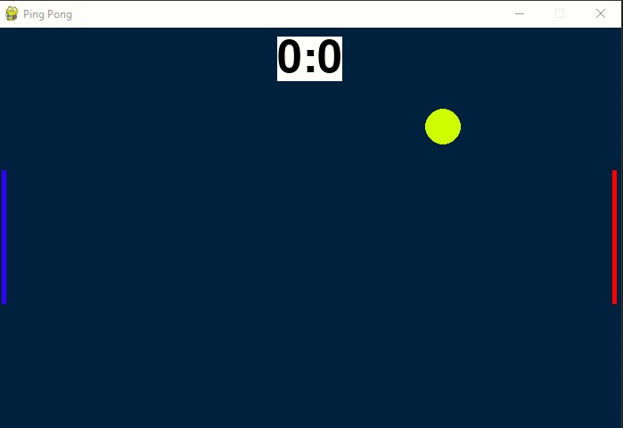

# :ping_pong: **Ping_Pong**

+ ***class Player***

For Player controls :
>    def move_down(self):
> 
            if self.y <= SCREEN_HEIGHT - self.height:

                self.y += self.speed

>  def move_up(self):
> 
            if self.y >= 0:

                self.y -= self.speed

 To move paddle up press 'w'

 To move paddle down press 's'

 To move paddle up press 'K_UP'

 To move paddle down press 'K_DOWN'

 

+ ***class Ball***

A ball that bounces off the paddles and walls 

:hammer_and_wrench: create_popup
  >https://www.geeksforgeeks.org/how-to-create-a-pop-up-in-pygame-with-pgu/

 

